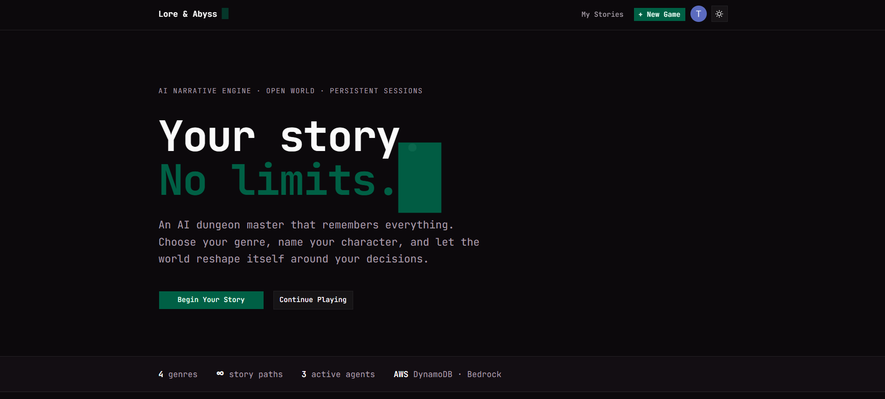
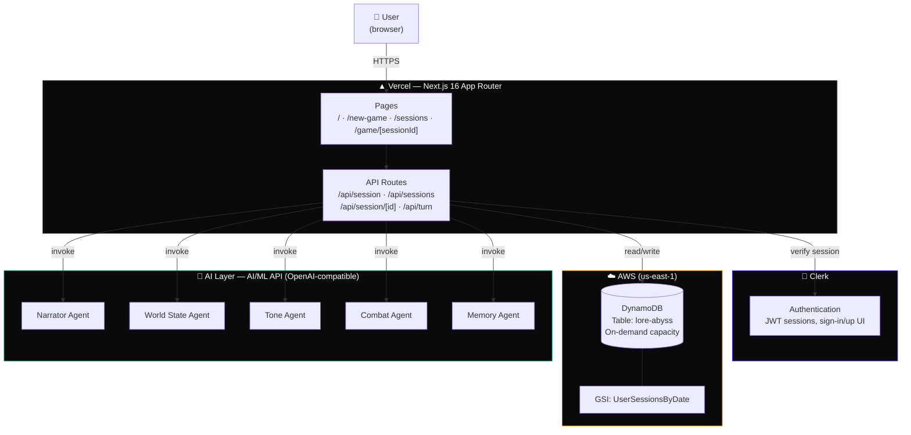
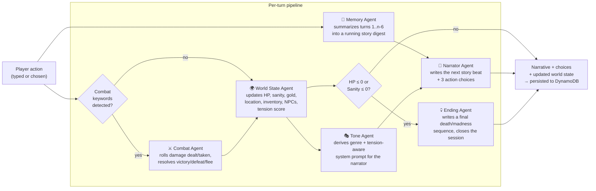
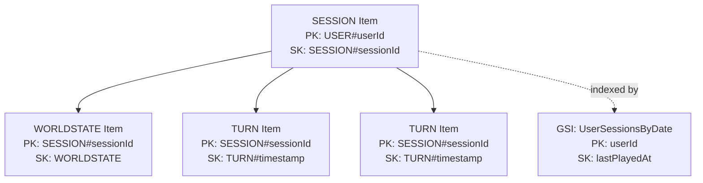
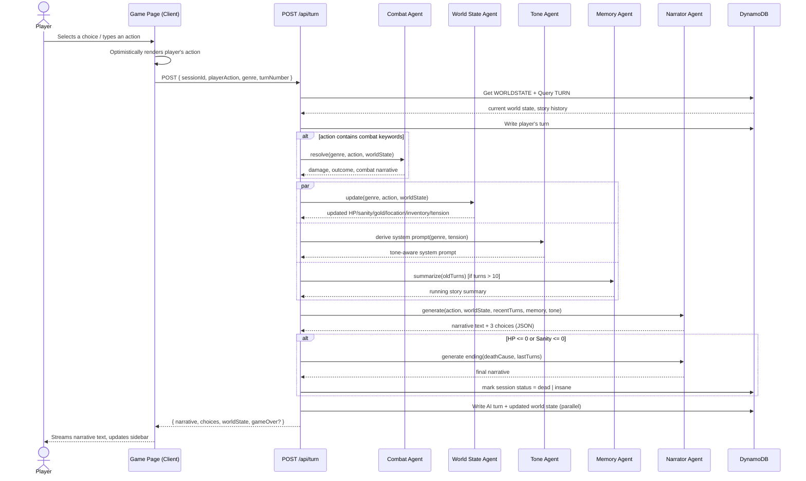
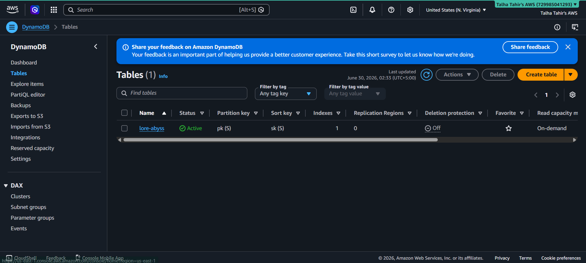
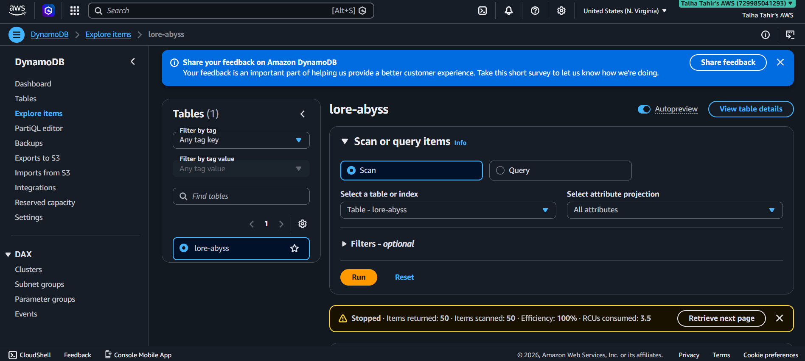

# Lore & Abyss 🗡️

> **Your story. No limits.**
> An AI-powered narrative RPG engine where a multi-agent orchestration system plays dungeon master — tracking your stats, your choices, and the world around you, turn by turn.
>
> Built for [H0: Hack the Zero Stack (Vercel v0 × AWS Databases)](https://h01.devpost.com/) — Track 4: Open Innovation.

> 🔗 **Repo:** https://github.com/Talha-Tahir2001/lore-and-abyss
> 
> 🔗 **Links**
>
> 🌐 Live Demo: https://lore-and-abyss.vercel.app/
>
> 🏆 Devpost Submission: https://devpost.com/software/lore-and-abyss
>
> 💻 GitHub Repository: https://github.com/Talha-Tahir2001/lore-and-abyss
>
> 📝 DEV.to Article: https://dev.to/talha666tahir/building-lore-and-abyss-a-streaming-ai-dungeon-crawler-with-nextjs-dynamodb-and-multi-agent-ai-150a
>
> ☁️ AWS Builders: https://builder.aws.com/content/3FpUnfVSttE6uZycnrvIWqG2NAZ/building-lore-and-abyss-a-streaming-ai-dungeon-crawler-with-nextjs-dynamodb-and-multi-agent-ai


---


# Lore & Abyss 🗡️

## What is Lore & Abyss?

A parent describes their child to generate a storybook; Lore & Abyss does the inverse — *you* describe what you do, and the engine generates the next moment of your story in real time. Pick a genre, name your character, and a pipeline of specialized AI agents narrates the scene, updates your HP/sanity/inventory/location, resolves combat with real damage numbers, and tracks the tension building behind every choice. Close the tab whenever you want — the full session, transcript and all, is waiting for you in DynamoDB when you come back.

---

## Table of Contents

- [What is Lore & Abyss?](#what-is-lore--abyss)
- [Why it's interesting](#why-its-interesting)
- [Tech stack](#tech-stack)
- [Features](#features)
- [System architecture](#system-architecture)
- [The agent pipeline](#the-agent-pipeline)
- [Data model (DynamoDB)](#data-model-dynamodb)
- [Turn lifecycle (sequence diagram)](#turn-lifecycle-sequence-diagram)
- [Project structure](#project-structure)
- [User flows](#user-flows)
- [API Endpoints](#api-endpoints)
- [Component reference](#component-reference)
- [Setup & local development](#setup--local-development)
- [Environment variables](#environment-variables)
- [AWS & Clerk setup](#aws--clerk-setup)
- [Key technical decisions](#key-technical-decisions)
- [Design decisions & trade-offs](#design-decisions--trade-offs)
- [Known limitations](#known-limitations)
- [Roadmap](#roadmap)
- [Hackathon submission notes](#hackathon-submission-notes)
- [AWS Database usage proof](#aws-database-usage-proof)

---

## What it does

You pick a genre — **Fantasy**, **Horror**, **Sci-Fi**, or **Noir** — name your character, and the engine generates an opening scene tailored to that world. From there, every action you take (a typed sentence or a pre-generated choice) is run through a pipeline of specialized AI agents that:

1. Decide what happens narratively
2. Update your character's stats, inventory, location, and the NPCs around you
3. Resolve combat with actual damage calculations when you fight
4. Keep the story coherent across long sessions by summarizing older turns
5. Track a **tension score** that drives pacing and the in-app tension meter
6. Persist everything to a database, so you can close the tab and pick the story back up exactly where you left off

If your HP or sanity hits zero, the story ends with an AI-generated, genre-appropriate death or madness sequence.

---

## Why it's interesting

Most "AI dungeon" demos are a single prompt wrapped in a chat UI. Lore & Abyss splits the dungeon master's job into **separate, specialized agents** — the same pattern used in real production multi-agent systems — so that narrative, world-state tracking, tone, and combat resolution are each handled by a prompt that's been scoped to do one job well, rather than one model trying to juggle storytelling, math, and consistency all at once.

It's also a genuine test of whether a **serverless, single-table DynamoDB design** can support a stateful, turn-based application with multiple related entities (sessions, world state, story turns) without a single line of SQL or a managed connection pool — which is exactly the kind of fast-to-ship, scales-on-its-own architecture this hackathon's stack is built around.

---

## Tech stack

| Layer | Technology | Why |
|---|---|---|
| Frontend | Next.js 16 (App Router), React 19, TypeScript | Fast to ship, server + client components, deploys natively to Vercel |
| Styling | Tailwind CSS v4, shadcn/ui | Utility-first, themeable via CSS variables, no design system lock-in |
| Auth | Clerk | Drop-in session management, no custom user table needed |
| Database | **AWS DynamoDB** (on-demand capacity) | Zero infra setup, single-table design, scales to millions of users via Global Tables |
| AI layer | AI/ML API (OpenAI-compatible endpoint, Llama 3.2) | Production-equivalent to AWS Bedrock; used here due to new-account Bedrock token throttling — architecture is Bedrock-compatible (see [Design Decisions](#design-decisions--trade-offs)) |
| Hosting | Vercel | One-click deploy from this repo, edge-ready |
| Diagramming | Mermaid (rendered below) | Versioned alongside the code |

---

## Features

- **Four genres, four voices** — Fantasy, Horror, Sci-Fi, and Noir each carry a distinct system prompt that shapes vocabulary, pacing, and stakes for the entire session, not just the opening scene
- **Streaming narrative** — story text streams in word by word rather than appearing all at once, reinforcing the "live dungeon master" feel
- **Living world state sidebar** — HP, sanity, gold, inventory, current location, and present NPCs update after every turn, sourced directly from the World State Agent's output
- **Tension meter** — a 0–100 score maintained by the World State Agent that visibly shifts the UI (Low → Rising → Critical) and feeds back into the Tone Agent to influence pacing
- **Combat resolution** — detected automatically from the player's action text and resolved with real damage numbers rather than the narrator hand-waving outcomes
- **Session persistence & resume** — closing the tab and returning later (or clicking "Continue" from the library) reconstructs the full transcript and world state from DynamoDB
- **Death / madness endings** — reaching 0 HP or 0 Sanity triggers a dedicated ending generation and permanently closes the session
- **Story export** — download any session's full transcript as Markdown or plain text
- **Ambient audio** — optional, genre-matched background audio (HTML5 Audio API, no external library)
- **Auth via Clerk** — every session, world state, and turn record is scoped to the authenticated user's ID; no anonymous data leakage between accounts
- **Dark, terminal-inspired UI** — leans into the text-adventure DNA of the genre instead of fighting it with generic gradients

---

## System architecture



**Why this shape:**
- **Vercel** owns the entire request lifecycle — pages and API routes deploy as one unit, no separate backend to manage or CORS to configure.
- **Clerk** is consulted on every protected route via middleware before any DynamoDB call is made, so unauthenticated requests never reach AWS.
- **DynamoDB** is the single source of truth for everything stateful: who owns which session, what the world currently looks like, and the full turn-by-turn transcript.
- **The agent layer** is stateless — every agent call receives exactly the context it needs (current world state, recent turns, the player's action) and returns structured JSON, so swapping the underlying model provider (AI/ML API → Bedrock → OpenAI directly) requires changing one file (`lib/ai.ts`), not the agents themselves.

---

## The agent pipeline

Rather than one model generating narrative, state changes, and tone in a single call, each turn runs through purpose-built agents:



| Agent | Trigger | Input | Output |
|---|---|---|---|
| **World State Agent** | Every turn | Current world state JSON + player action | Updated HP, sanity, gold, location, inventory, NPCs, tension score |
| **Tone Agent** | Every turn | Genre + current tension score | A system prompt that shifts the narrator's voice (exploratory → critical dread) |
| **Narrator Agent** | Every turn | Recent turns, memory summary, updated world state, tone system prompt | 3-4 sentence narrative + 3 next-action choices, returned as strict JSON |
| **Combat Agent** | Player action contains a combat keyword (attack, fight, flee, etc.) | World state + action | Damage dealt/taken, outcome, a short combat-specific narrative beat |
| **Memory Agent** | Story exceeds 10 turns | All turns except the most recent 6 | A 3-4 sentence running summary, injected into the Narrator's context so the story stays coherent without re-sending the entire transcript every turn |
| **Ending Agent** | HP or sanity hits 0 after World State Agent runs | Last 3 turns + cause of death | A final, dramatic, genre-appropriate closing scene; marks the session `dead` or `insane` in DynamoDB |

All agents call the same underlying client (`lib/ai.ts`) and are prompted to return **strict JSON only**, with a regex-based fallback parser in case a model wraps its output in markdown fences.

---

## Data model (DynamoDB)

Single-table design. One table, four access patterns, one GSI.

```mermaid
erDiagram
    SESSION {
        string pk "USER-userId"
        string sk "SESSION-sessionId"
        string sessionId
        string userId
        string genre
        string characterName
        string sessionName
        string status "active, dead, or insane"
        string createdAt
        string lastPlayedAt
    }
    WORLD_STATE {
        string pk "SESSION-sessionId"
        string sk "WORLDSTATE"
        number hp
        number maxHp
        number sanity
        number maxSanity
        number gold
        string location
        list inventory
        list activeCharacters
        number tensionScore
        string updatedAt
    }
    TURN {
        string pk "SESSION-sessionId"
        string sk "TURN-isoTimestamp"
        string type "system, user, or ai"
        string content
        list choices
        number turnNumber
        string createdAt
    }

    SESSION ||--|| WORLD_STATE : "has one"
    SESSION ||--o{ TURN : "has many"
```

OR



### Access patterns

| Need | Query | Index |
|---|---|---|
| All sessions for a user, most recent first | `pk = USER#{userId}, sk begins_with SESSION#` | GSI `UserSessionsByDate` (PK: `userId`, SK: `lastPlayedAt`) |
| Full story transcript for a session | `pk = SESSION#{sessionId}, sk begins_with TURN#` | Base table, `ScanIndexForward: true` |
| Current world state for a session | `pk = SESSION#{sessionId}, sk = WORLDSTATE` | Base table, `GetItem` |
| Single session metadata | `pk = USER#{userId}, sk = SESSION#{sessionId}` | Base table, `GetItem` |

This design means every screen in the app is satisfied by **one or two DynamoDB calls**, with no scans and no joins — the `/game/[sessionId]` resume flow, for example, fires three parallel `GetItem`/`Query` calls and renders the full story in one round trip.

---

## Turn lifecycle (sequence diagram)

What happens between a player clicking a choice and seeing the next story beat:



---

## Project structure

```
lore-and-abyss/
├── app/
│   ├── page.tsx                       # Landing page
│   ├── new-game/page.tsx              # Genre + character selection
│   ├── sessions/page.tsx              # Session library (real DynamoDB data)
│   ├── game/[sessionId]/page.tsx      # Main game UI (story + world state panels)
│   ├── sign-in/[[...sign-in]]/page.tsx
│   ├── sign-up/[[...sign-up]]/page.tsx
│   └── api/
│       ├── session/route.ts           # POST — create a new session
│       ├── session/[sessionId]/route.ts # GET — resume an existing session
│       ├── sessions/route.ts          # GET — list a user's sessions
│       └── turn/route.ts              # POST — the agent orchestrator
├── components/
│   ├── Navbar.tsx
│   └── ui/                            # shadcn/ui primitives
├── lib/
│   ├── dynamodb.ts                    # DynamoDB DocumentClient setup
│   └── ai.ts                          # AI/ML API client (invokeModel)
├── middleware.ts                      # Clerk route protection
└── .env.local                         # Environment variables (not committed)
```

---

## User flows

### Authentication
```
/ (public) → click "Begin Your Story" →
  not signed in → Clerk modal (sign in / sign up) → redirect back to intended page
  signed in     → straight through
```

### Create a story
```
/new-game
  ├─ Select a genre (Fantasy / Horror / Sci-Fi / Noir)
  ├─ Name your character
  ├─ Click "Enter the Story"
  │   └─ POST /api/session
  │       ├─ Narrator Agent writes the opening scene
  │       ├─ A short evocative session title is generated
  │       └─ SESSION + WORLDSTATE + opening TURN# written to DynamoDB
  └─ Redirect to /game/[sessionId]
```

### Play a turn
```
/game/[sessionId]
  ├─ Player clicks a choice OR types a custom action
  ├─ POST /api/turn
  │   ├─ Combat Agent (if action is combat-flavored)
  │   ├─ World State Agent + Tone Agent (parallel)
  │   ├─ Memory Agent (if session > 10 turns)
  │   ├─ Narrator Agent → next narrative + 3 choices
  │   └─ Death/madness check → Ending Agent if HP or Sanity hit 0
  └─ UI streams the narrative in, updates sidebar, re-renders choices
```

### Resume a story
```
/sessions → click "Continue" on any session
  └─ /game/[sessionId] (no sessionStorage present)
      └─ GET /api/session/[sessionId]
          └─ Parallel fetch: SESSION metadata + WORLDSTATE + all TURN# records
      └─ Full transcript + world state + last choices reconstructed in one round trip
```

### Export a story
```
/game/[sessionId] or /sessions
  └─ Click "Export"
      └─ Full TURN# transcript formatted client-side as Markdown or plain text
      └─ Browser download triggered (no server round trip needed)
```

---

## API Endpoints

All routes live under `app/api/` and are protected by Clerk middleware unless noted otherwise.

| Method | Endpoint | Purpose | Auth |
|---|---|---|---|
| `POST` | `/api/session` | Create a new session: generates the opening narrative + session title, writes `SESSION`, `WORLDSTATE`, and the opening `TURN#` to DynamoDB | ✅ required |
| `GET` | `/api/sessions` | List all sessions for the current user, most recent first (uses the `UserSessionsByDate` GSI) | ✅ required |
| `GET` | `/api/session/[sessionId]` | Resume a session — fetches `SESSION` metadata, `WORLDSTATE`, and the full `TURN#` transcript in parallel | ✅ required |
| `POST` | `/api/turn` | The core agent orchestrator — runs Combat/World State/Tone/Memory/Narrator agents for one turn, persists the result, returns narrative + choices + updated world state | ✅ required |

### `POST /api/session`

**Request body:**
```json
{
  "genre": "Fantasy",
  "characterName": "Aldric"
}
```

**Response:**
```json
{
  "sessionId": "1782570471477-vayy5",
  "sessionName": "The Sarcophagus Breathes",
  "openingNarrative": "The torch sputtered, throwing long, clawing shadows..."
}
```

### `POST /api/turn`

**Request body:**
```json
{
  "sessionId": "1782570471477-vayy5",
  "playerAction": "Touch the hand",
  "genre": "Fantasy",
  "turnNumber": 1
}
```

**Response (normal turn):**
```json
{
  "narrative": "As your fingers brush the pale skin...",
  "choices": ["Pull away sharply", "Press your palm flat against it", "Speak to it"],
  "worldState": {
    "hp": 100,
    "maxHp": 100,
    "sanity": 92,
    "maxSanity": 100,
    "gold": 50,
    "location": "The Sunken Crypt",
    "inventory": ["Torch", "Basic Supplies"],
    "activeCharacters": [],
    "tensionScore": 35
  }
}
```

**Response (death/ending):**
```json
{
  "narrative": "The cold finally takes him, the last warmth fading...",
  "choices": [],
  "worldState": { "...": "..." },
  "gameOver": true,
  "gameOverReason": "dead"
}
```

### `GET /api/session/[sessionId]`

**Response:**
```json
{
  "session": {
    "sessionId": "1782570471477-vayy5",
    "genre": "Fantasy",
    "characterName": "Aldric",
    "sessionName": "The Sarcophagus Breathes",
    "status": "active"
  },
  "worldState": { "...": "..." },
  "story": [{ "type": "system", "content": "..." }],
  "lastChoices": ["...", "...", "..."],
  "lastTurnNumber": 7
}
```

### `GET /api/sessions`

**Response:**
```json
{
  "sessions": [
    {
      "id": "1782570471477-vayy5",
      "genre": "Fantasy",
      "title": "The Sarcophagus Breathes",
      "characterName": "Aldric",
      "lastPlayed": "2 hours ago",
      "status": "active"
    }
  ]
}
```

---

## Component reference

### `app/game/[sessionId]/page.tsx`
The main game client component. Owns the story array, world state, choices, and game-over state. Loads from `sessionStorage` on a fresh session (fastest path right after creation) or falls back to `GET /api/session/[sessionId]` when resuming from a direct URL or the library. Handles streaming narrative rendering, mobile tab switching between Story and World State, and disables input once a session reaches `dead` or `insane` status.

### `lib/ai.ts`
The single provider-agnostic AI client. Exposes one function — `invokeModel(prompt, systemPrompt)` — used identically by every agent. Swapping the underlying provider (AI/ML API → Bedrock → OpenAI) means changing this file only.

### `lib/dynamodb.ts`
Sets up the `DynamoDBDocumentClient`, which wraps the raw `DynamoDBClient` to automatically marshal/unmarshal plain JS objects, so the rest of the codebase never touches DynamoDB's native `{ S: "value" }` type syntax.

### `middleware.ts`
Clerk route protection. Public routes: `/`, `/sign-in`, `/sign-up`. Protected routes: `/new-game`, `/game/*`, `/sessions`, and all `/api/*` routes except none — every API route requires a signed-in user.

### `components/Navbar.tsx`
Shared nav bar with conditional rendering via Clerk's `<Show when="signed-in">` / `<Show when="signed-out">` components — shows "My Stories" / "+ New Game" / `UserButton` when signed in, a single "Sign In" button (opening Clerk's modal) when signed out.

---

## Setup & local development

### Prerequisites
- Node.js 22+
- An AWS account (free tier is enough)
- A Clerk account (free tier)
- An AI/ML API key ([aimlapi.com](https://aimlapi.com))

### 1. Clone and install

```bash
git clone https://github.com/Talha-Tahir2001/lore-and-abyss.git
cd lore-and-abyss
npm install
```

### 2. Configure environment variables

See [Environment variables](#environment-variables) below.

### 3. Run

```bash
npm run dev
```

Visit `http://localhost:3000`.

---

## Environment variables

```bash
# Clerk
NEXT_PUBLIC_CLERK_PUBLISHABLE_KEY=pk_test_...
CLERK_SECRET_KEY=sk_test_...
NEXT_PUBLIC_CLERK_SIGN_IN_URL=/sign-in
NEXT_PUBLIC_CLERK_SIGN_UP_URL=/sign-up
NEXT_PUBLIC_CLERK_SIGN_IN_FALLBACK_REDIRECT_URL=/
NEXT_PUBLIC_CLERK_SIGN_UP_FALLBACK_REDIRECT_URL=/

# AWS
AWS_REGION=us-east-1
AWS_ACCESS_KEY_ID=AKIA...
AWS_SECRET_ACCESS_KEY=...

# AI/ML API
AIML_API_KEY=...
AIML_BASE_URL=https://api.aimlapi.com/v1
AIML_MODEL=meta-llama/Llama-3.2-3B-Instruct-Turbo
```

### Where to get each value

| Variable | Source |
|---|---|
| `NEXT_PUBLIC_CLERK_PUBLISHABLE_KEY` / `CLERK_SECRET_KEY` | [dashboard.clerk.com](https://dashboard.clerk.com) → your app → API Keys |
| `AWS_ACCESS_KEY_ID` / `AWS_SECRET_ACCESS_KEY` | IAM → Users → your user → Security credentials → Create access key |
| `AIML_API_KEY` | [aimlapi.com](https://aimlapi.com) → Dashboard → API Keys |

---

## AWS & Clerk setup

### Create the DynamoDB table

In the AWS Console → DynamoDB → Create table:
- Table name: `lore-abyss`
- Partition key: `pk` (String)
- Sort key: `sk` (String)
- Capacity mode: **On-demand**

Then add a Global Secondary Index:
- Index name: `UserSessionsByDate`
- Partition key: `userId` (String)
- Sort key: `lastPlayedAt` (String)
- Projected attributes: All

### Create an IAM user

IAM → Users → Create user → attach `AmazonDynamoDBFullAccess` → generate an access key pair (application running outside AWS) → copy both keys immediately, AWS never shows the secret again.

> **Note on case sensitivity:** DynamoDB key names are case-sensitive. This project uses lowercase `pk`/`sk` throughout — make sure your table's partition and sort key names match exactly, or every `PutCommand`/`GetCommand`/`QueryCommand` call will fail with `Missing the key pk in the item`.

### Set up Clerk

1. Create an application at [dashboard.clerk.com](https://dashboard.clerk.com)
2. Copy the publishable and secret keys into `.env.local`
3. Under **Configure → Paths**, set:
   - Sign-in URL: `/sign-in`
   - Sign-up URL: `/sign-up`
   - After sign-in URL: `/`
   - After sign-up URL: `/`
4. Create the catch-all route pages — `app/sign-in/[[...sign-in]]/page.tsx` and `app/sign-up/[[...sign-up]]/page.tsx` — rendering Clerk's `<SignIn />` / `<SignUp />` components. These pages must exist or Clerk's OAuth callback will 404.

---

## Key technical decisions

### Single-table DynamoDB design over multiple tables
Sessions, world state, and turns are queried together far more often than independently. A single table with `pk`/`sk` composite keys keeps every screen's data fetchable in one or two calls without joins — the standard DynamoDB pattern for this access shape. See [Data model](#data-model-dynamodb) for the full key schema.

### Provider-agnostic AI client (`lib/ai.ts`)
Every agent calls the same `invokeModel(prompt, systemPrompt)` function regardless of which model provider sits behind it. This was a deliberate seam: the original design targeted AWS Bedrock directly, and when a brand-new AWS account hit Bedrock's default token-per-day throttling mid-build, switching providers to AI/ML API was a one-file change rather than a rewrite across five agent functions.

### Split agents instead of one mega-prompt
Early testing showed that asking a single model call to simultaneously write prose, return structured JSON for stat changes, and resolve combat damage produced inconsistent JSON and diluted narrative quality. Separating concerns into Narrator / World State / Tone / Combat / Memory agents let each prompt stay short, focused, and reliably parseable — at the cost of more total model calls per turn, mitigated by running independent agents in parallel with `Promise.all`.

### `use()` for async route params
Next.js 16 made `params` a Promise in client components. Rather than converting the game page to a server component (which would break the streaming, optimistic-update client state the page depends on), `params` is unwrapped with React 19's `use()` hook, keeping the page a client component while staying compatible with the new async params contract.

### Resume-over-sessionStorage priority
`sessionStorage` is only ever populated immediately after `POST /api/session` succeeds, as a fast path to avoid an extra round trip on the very first render. Every other entry point — direct URL, "Continue" from the library, a refreshed tab — always fetches from `GET /api/session/[sessionId]` instead, since DynamoDB is the only source that's guaranteed complete.

---

## Design decisions & trade-offs

**Why DynamoDB over Aurora.** As a team new to AWS with a hard 3-day deadline, Aurora's VPC/security-group/connection-pooling setup was assessed as too high-risk to configure correctly in the available time. DynamoDB's on-demand, serverless-by-default model meant zero infrastructure decisions beyond table and index creation, while still satisfying the track requirement and giving a legitimate "scales to millions" story via Global Tables.

**Why AI/ML API instead of AWS Bedrock in the running app.** The original design targeted AWS Bedrock directly via `@aws-sdk/client-bedrock-runtime`, and that integration code exists and works. In practice, a brand-new AWS account hit Bedrock's default per-account token-per-day throttling almost immediately, which would have cost the better part of a build day to resolve via a quota increase request. The `lib/ai.ts` abstraction (`invokeModel(prompt, systemPrompt)`) was built to be provider-agnostic for exactly this reason — switching back to Bedrock is a one-file change, not an architecture change.

**Why single-table DynamoDB design instead of multiple tables.** Sessions, world state, and turns are all queried together far more often than independently. A single table with `pk`/`sk` composite keys keeps every screen's data fetchable in one or two calls without joins, which is the standard DynamoDB pattern for this kind of access shape.

**Why split agents instead of one mega-prompt.** Early testing showed that asking a single model call to simultaneously write prose, return structured JSON for stat changes, and resolve combat damage produced inconsistent JSON and diluted narrative quality. Separating concerns let each agent's prompt be short, focused, and reliably parseable — at the cost of more total model calls per turn, mitigated by running independent agents in parallel.

---

## Known limitations

- Bedrock integration code is present but not the active path (see above) — swapping requires resolved AWS Bedrock model access/quota.
- Memory Agent summarization is not yet cached — it re-summarizes older turns on every call past the 10-turn threshold rather than persisting the summary; an obvious follow-up is storing the summary in the `SESSION` item and only regenerating it incrementally.
- No image generation yet — the architecture diagram above includes a planned Image Generation Agent for future work.
- Combat keyword detection is string-matching based rather than intent-classified, so unusual phrasing for a combat action may not trigger the Combat Agent.

## Roadmap

- [ ] Persisted/incremental Memory Agent summaries
- [ ] Image Generation Agent for key scene beats
- [ ] Multiplayer co-op sessions via DynamoDB Streams
- [ ] Full Bedrock cutover once quota is resolved
- [ ] Voice narration (text-to-speech per genre)

---

## Hackathon submission notes

**Track:** Open Innovation (Track 4)

**What makes Lore & Abyss memorable for judges:**
1. The multi-agent split — five distinct agents each doing one job, not one prompt pretending to do everything
2. The architecture honesty — the README documents the actual Bedrock-to-AI/ML-API swap and why, rather than presenting a sanitized version of the build
3. Genuine resume — close the tab mid-story, come back a day later, the world state and full transcript are exactly where you left them
4. The demo moment — pick Horror, type something reckless, watch the tension meter climb to Critical and the narrative tone shift in real time

**Database used:** AWS DynamoDB (on-demand capacity), single-table design with one GSI. See [Data model](#data-model-dynamodb) and [AWS Database usage proof](#aws-database-usage-proof) below.

---
### AWS Dynamo DB Dashboard


---

### AWS Dynamo DB Item Explorer 

---

## AWS Database usage proof

See `/docs/screenshots` in this repo for:
- DynamoDB table configuration (`lore-abyss`, on-demand capacity, `pk`/`sk` schema)
- GSI configuration (`UserSessionsByDate`)
- Live table items showing `SESSION`, `WORLDSTATE`, and `TURN#` records from actual gameplay
---


## License

This project is open-source and available under the [MIT License](https://github.com/Talha-Tahir2001/lore-and-abyss/blob/main/LICENSE).

---

## Submission
Built by [Talha Tahir](https://github.com/Talha-Tahir2001) for [H0: Hack the Zero Stack (Vercel v0 × AWS Databases)](https://h01.devpost.com/)

---

\#H0Hackathon \#Vercel \#AWSDynamoDB

---
